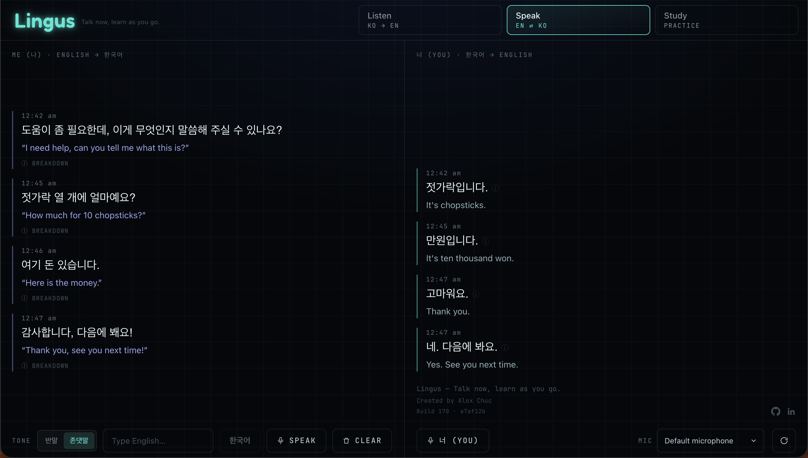
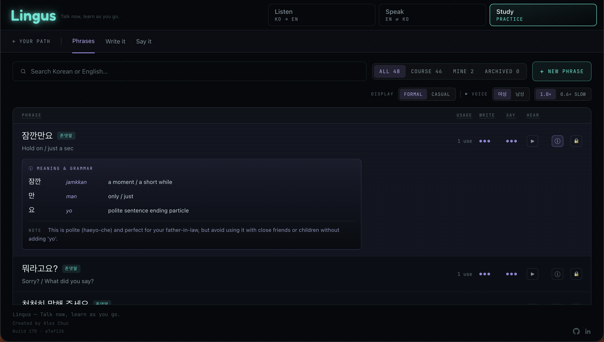
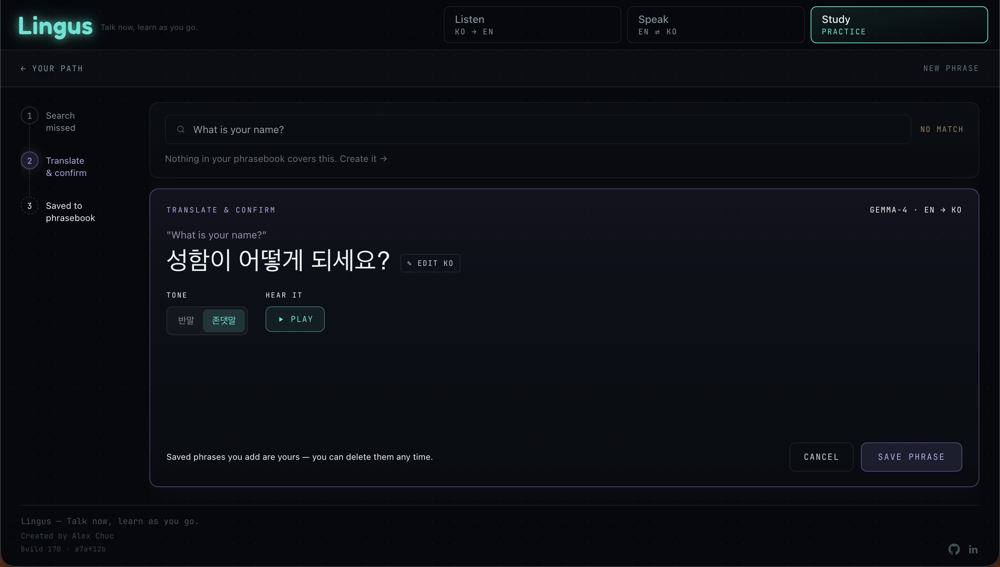
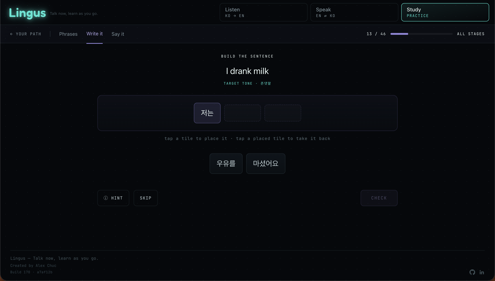
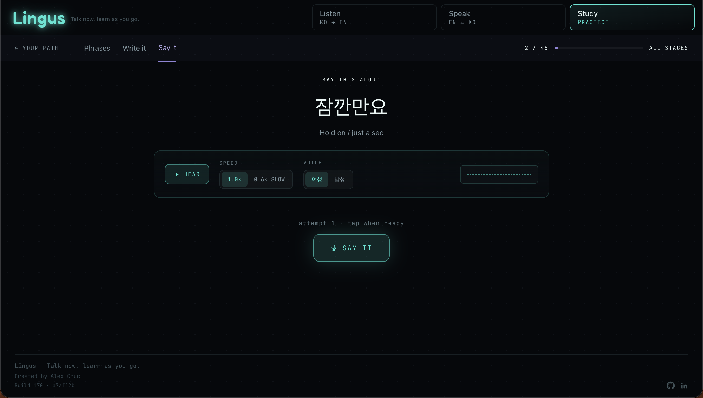
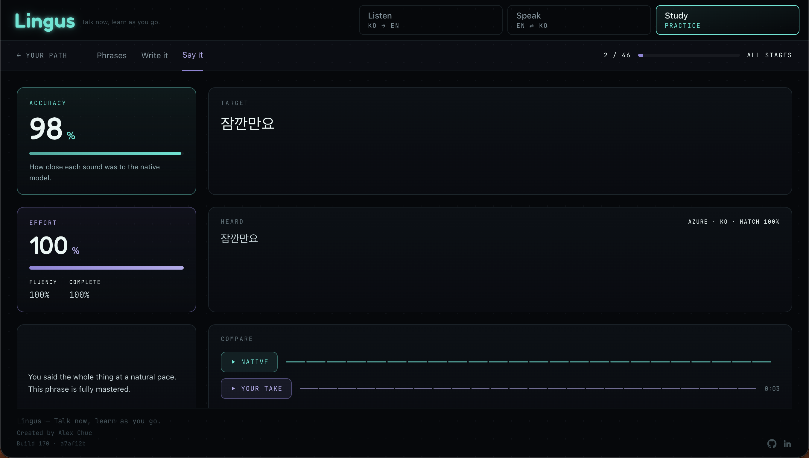
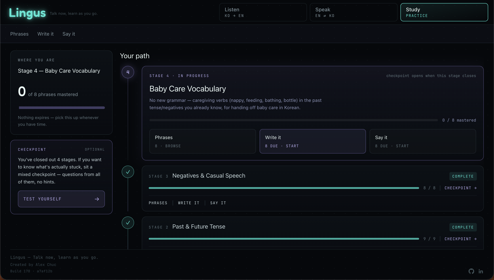
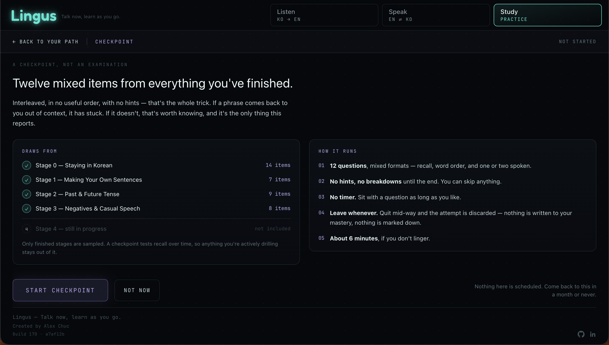

# Lingus — Talk now, learn as you go.

Self-hosted Korean ↔ English language tool built for live video calls with Korean-speaking family and for structured study between calls. Three tabs: **Listen** (real-time KO→EN transcription), **Speak** (EN→KO composition), and **Study** (spaced curriculum built from real call data).

Production deployment: `lingus.alexchuc.au`

---

## The problem

Every common translation app — Google Translate, Papago, Microsoft Translator — stops transcribing on silence. Natural conversation, especially with an elder speaker, has 3–5 second pauses between thoughts. Every pause kills the transcript and breaks the flow.

A secondary constraint shaped the entire architecture: the target phone runs GrapheneOS, which blocks Google Play Services. The browser-native Web Speech API depends on Google's speech recognition — blocked entirely. That pushed the full STT/translation/TTS stack off-device onto edge compute and ruled out browser-native speech recognition across the whole app.

---

## Architecture

```
┌──────────────────────────────────┐
│  Mac (BlackHole virtual audio)   │
│  captures call audio digitally   │
└────────────┬─────────────────────┘
             │ 1. clean audio, no re-recording
             ▼
┌──────────────────────────────────┐
│  Browser — React SPA             │
│  AudioWorklet · silence-boundary │
│  VAD segments per utterance      │
└────────────┬─────────────────────┘
             │ 2. WAV per utterance
             ▼
┌──────────────────────────────────┐
│  Cloudflare Workers AI           │
│  Whisper large-v3-turbo → STT    │
│  Gemma 4 → translation           │
│  (both directions, 5-turn        │
│  rolling context window)         │
└────────────┬─────────────────────┘
             │ 3. static build + Pi-side persistence
             ▼
┌──────────────────────────────────┐
│  Pi 4B (self-hosted)             │
│  nginx · Cloudflare Tunnel       │
│  server-side study/speak store   │
│  (no inbound ports required)     │
└──────────────────────────────────┘
```

**Azure Speech** handles TTS and pronunciation scoring in the Study tab. It is scoped there only — Workers AI handles all translation and STT for live calls.

---

## Listen — KO → EN

Real-time Korean speech to English transcription during a live video call. Audio is captured digitally via BlackHole (no mic re-recording) and segmented by silence boundaries via AudioWorklet VAD — utterances are not cut mid-sentence regardless of pause length. Each segment is sent to Whisper large-v3-turbo with a forced `ko` language hint, then to Gemma 4 with a 5-turn rolling context window for coherent pronoun resolution across turns.

The live pipeline health rail shows backend connectivity, transcription and translation latency, and confidence score per utterance in real time.


**Key implementation decisions:**
- AudioWorklet replaced an earlier MediaRecorder approach. Whisper rejects WebM outright; fixed-interval chunking cut Korean's SOV sentences mid-utterance.
- Silence-boundary VAD segments by utterance, not by time — pauses of any length are tolerated.
- Transcript lines ordered by capture time, not STT arrival — avoids out-of-order display when network latency varies (`1768302`).
- Gemma 4 keep-warm heartbeat runs during live calls to eliminate cold-start latency (`dab833a`).
- Llama 3.1 → Gemma 4 swap was benchmark-driven, not assumed (`5d64a59`).
- Speaker diarization was prototyped and removed — the complexity didn't survive real-call validation; Pause/Unpause replaced it (`c1804fe`).
- Whisper prompt biasing was tested and removed after it introduced echo regression (`a82ce08`).

---

## Speak — EN ⇄ KO

Bidirectional composition panel for practising Korean in a structured conversation. Left column: type English, Gemma 4 translates to Korean with formal/casual tone toggle, with per-entry sentence breakdown. Right column: the other speaker's Korean side, transcribed and translated to English in real time. Conversation persisted server-side on the Pi — browser storage (localStorage) was evicted by Brave's aggressive memory management (`f6bf9ac`).



---

## Study — structured curriculum from real call data

A Korean learning curriculum built directly from conversations. Phrases heard during calls are mined post-call and surfaced for study. Study data persisted server-side on the Pi for cross-device access (`c0ef579`).

**Your Path** — staged curriculum across four stages: Staying in Korean (Stage 0), Making Your Own Sentences (Stage 1), Past & Future Tense (Stage 2), Negatives & Casual Speech (Stage 3), Baby Care Vocabulary (Stage 4). Each stage gates on completion before the next opens. Curriculum content for 반말/존댓말 (casual/formal) verified by a native speaker.



**Phrases** — browsable phrasebook with formal/casual display toggle, per-phrase meaning and grammar breakdown, TTS playback at 1.0× and 0.6× slow, male/female voice selection. New phrases can be added via a Gemma 4-powered wizard: search a missed phrase, translate and confirm, hear it, edit if needed, save.




**Write it** — tile-arrangement practice. Given an English sentence, drag Korean word tiles into correct SOV order. Targets the structural difference between English and Korean that causes the most spoken errors.



**Say it** — pronunciation practice via Azure Speech. Hear the phrase at native speed or 0.6× slow (female or male voice), then record and submit. Azure scores accuracy, fluency, completeness, and effort against the native model, with waveform comparison between native and your take.




**Checkpoint** — interleaved recall test across all completed stages. 12 mixed questions, no hints, no timer, no pressure — quit any time and the attempt is discarded. Only finished stages are sampled. Designed to surface what has actually stuck, not what was recently drilled.



---

## Infrastructure

| Component | Implementation |
|---|---|
| Hosting | Raspberry Pi 4B, Debian Trixie ARM64 |
| Web server | nginx — serves the static React build |
| External access | Cloudflare Tunnel — no inbound ports; replaces dynamic DNS + port forwarding after ISP blocked residential inbound |
| TLS | Let's Encrypt via Certbot DNS-01 challenge (Cloudflare plugin) |
| Access control | Cloudflare Access — email-allowlisted PIN gate on the subdomain |
| API key handling | Workers AI keys live only in the Worker's environment — never in the browser |
| nginx rate limiting | Backstop against abuse on the `/transcribe` and `/translate` endpoints |
| Server-side persistence | Pi-local store for Study curriculum progress and Speak conversation history |

**Rejected alternatives:**
- Port forwarding: ISP change blocked inbound ports on the residential plan. Cloudflare Tunnel eliminated the dependency entirely.
- HTTP-01 certificate challenge: the admin subdomain is intentionally internet-unreachable. DNS-01 was the only viable option.
- Browser localStorage for Speak history: Brave evicts aggressively under memory pressure. Moved to Pi-side persistence.
- Express/Google Translate proxy: removed in favour of direct Workers AI calls from the browser. Eliminated a maintenance surface with no benefit (`5f5d2a3`).

---

## Security

- Cloudflare Access PIN gate — email allowlist; no password stored
- API keys in Worker environment only — never exposed to the browser or served in static build
- nginx rate limiting on transcription and translation endpoints
- Cloudflare Tunnel — no open inbound ports on the Pi or router
- robots.txt + noindex meta — app not indexed

---

## Stack

`React` `Cloudflare Workers AI` `Whisper large-v3-turbo` `Gemma 4` `Azure Speech` `nginx` `Cloudflare Tunnel` `Cloudflare Access` `Let's Encrypt` `systemd` `Raspberry Pi`
